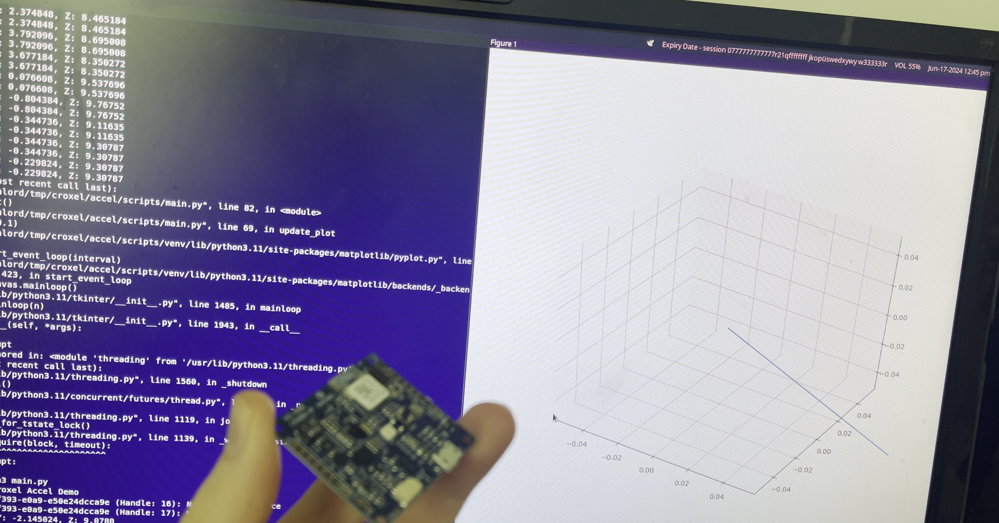

# Croxel CX1825 Accelerometer over NUS Demo

<p align="center">
  
</p>

A simple demo to read the LIS3DH accelerometer and report results using the Nordic UART Service (NUS) logging backend

To build:
```
west build -b croxel_cx1825/nrf52840 -S rtt-console -p
```

Create a virtual environment, install dependencies, then run "scripts/main.py" to visualize the data coming over the air!
```
cd scripts
python3 -m venv venv
source venv/bin/activate
pip install -r requirements.txt
python3 ./main.py
```

You can also use the nRF Connect app for Android or iOS to connect.
https://www.nordicsemi.com/Products/Development-tools/nRF-Connect-for-mobile

Special thanks to Luis and the team at Croxel for the CX1825!
